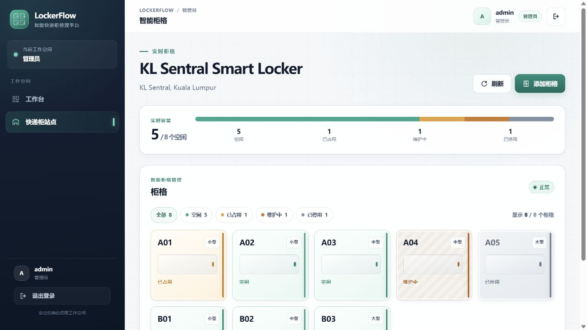
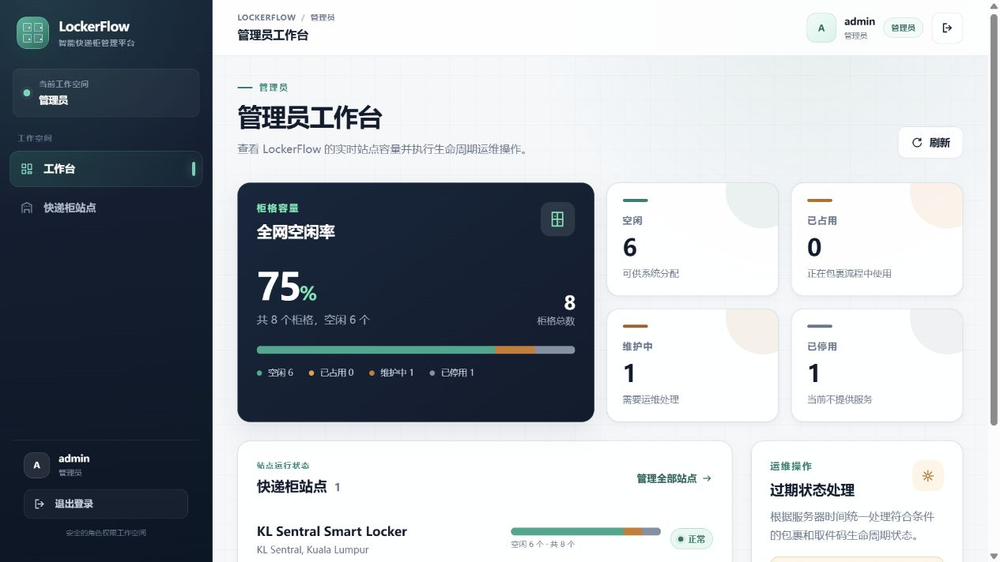
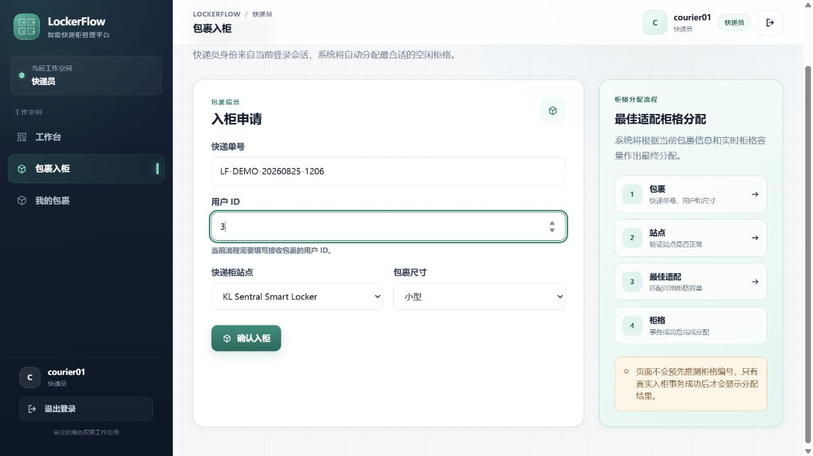
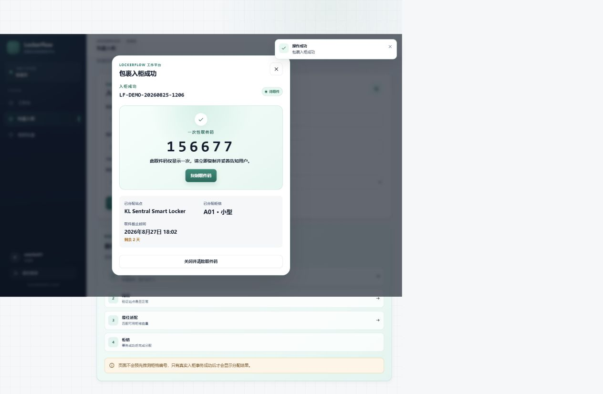
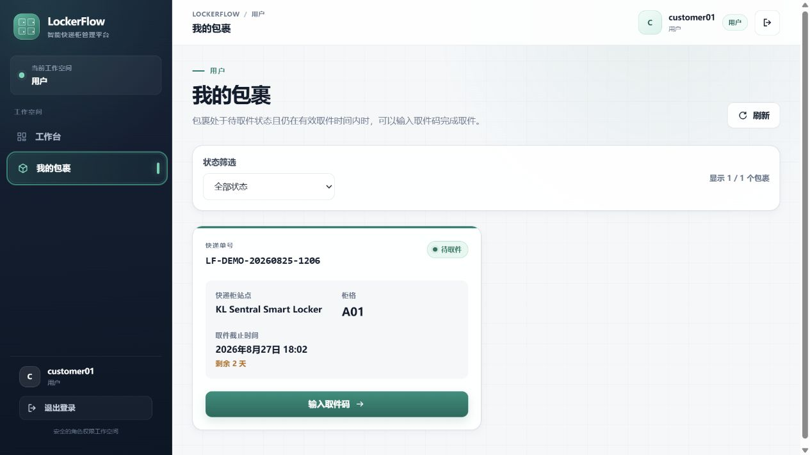
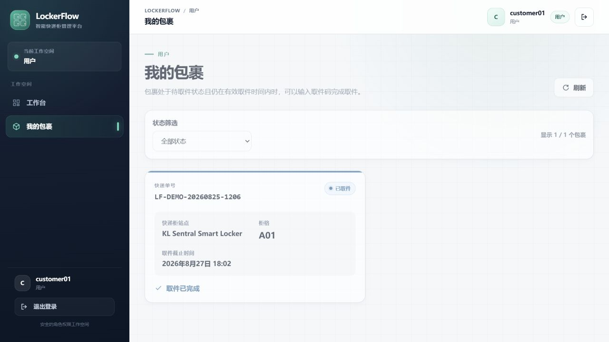

# LockerFlow

> 智能快递柜与取件管理平台  
> Smart Parcel Locker & Pickup Management Platform

GitHub：<https://github.com/JianFeng1104/LockerFlow>

在线体验：<https://locker-flow.vercel.app>

LockerFlow 是一个面向快递员、用户和管理员的全栈快递柜管理项目。快递员将包裹存入站点后，系统按包裹尺寸自动选择最合适的空闲柜格，生成一次性取件码；用户在身份校验后完成取件，柜格随即释放。

管理员可以维护站点与柜格、查看实时容量及四种柜格状态，并手动触发过期生命周期处理。项目重点展示真实 REST API 集成、后端授权、事务边界、并发竞争处理和可验证的端到端业务闭环。

## 核心流程

```text
快递员入柜
    ↓
最佳适配柜格分配
    ↓
柜格变为 OCCUPIED
    ↓
生成一次性取件码
    ↓
用户身份绑定取件
    ↓
包裹变为 PICKED_UP，柜格释放为 AVAILABLE
```

过期流程刻意区分“逻辑过期”和“物理清柜”：

```text
STORED → EXPIRED
柜格仍保持 OCCUPIED，等待未来的物理清柜流程
```

## 项目截图

### 智能柜格实时状态



### 管理员容量工作台



### 快递员入柜与一次性取件码





### 用户包裹与取件结果





更多截图说明见 [docs/SCREENSHOTS.md](docs/SCREENSHOTS.md)。

## 技术栈

| 层级 | 技术 |
| --- | --- |
| Backend | Java 21、Spring Boot 3.5、Spring Data JPA、Hibernate、MySQL 8、Flyway、Spring Security、OAuth2 Resource Server / JWT |
| Frontend | Vue 3、Vite、Pinia、Vue Router、Axios、Tailwind CSS |
| Testing | JUnit 5、MockMvc、Spring Boot Test、H2、Vitest、Vue Test Utils |

## 后端亮点

- **最佳适配分柜**：小件按 `SMALL → MEDIUM → LARGE`，中件按 `MEDIUM → LARGE`，大件只使用 `LARGE`；同尺寸按柜格编号稳定选择。
- **事务化入柜**：包裹、柜格占用和取件码签发在同一业务事务中完成，失败时整体回滚。
- **一次性取件码**：使用 `SecureRandom` 生成 6 位码，数据库只保存 BCrypt 哈希，明文仅在入柜响应中显示一次。
- **JWT 与 RBAC**：HS256 JWT、无状态认证、后端角色授权；快递员和用户身份均来自 JWT subject，不能由请求参数冒充。
- **生命周期**：定时任务与管理员操作可将到期包裹和取件码标记为过期，同时保留真实物理占用语义。
- **并发控制**：柜格分配使用乐观锁与有界的新事务重试；取件和过期竞争通过悲观行锁串行化。锁定顺序统一为 `Parcel → PickupCode → LockerCell`，并由确定性集成测试覆盖。

## 安全设计

- 用户密码使用 BCrypt 哈希保存。
- JWT 密钥必须从环境变量提供，后端不包含可用默认密钥。
- API 采用无状态认证和后端 RBAC。
- 用户取件校验当前 JWT 身份与包裹所有权。
- 取件码明文不落库，只保存 BCrypt 哈希。
- 前端只在 `sessionStorage` 保存 Access Token，关闭会话后不再持久保留。

当前未实现 Refresh Token、Token Revocation 和 Rate Limiting；这些属于后续增强项，不在当前安全能力声明内。

## 前端体验

- 简体中文界面与角色感知导航。
- 管理员、快递员、用户三个独立工作空间。
- 真实 API 数据和智能柜格状态视图。
- 响应式桌面/移动布局。
- 一致的 Loading、Error、Empty 和操作反馈状态。
- 一次性取件码仅保留在当前页面内存，关闭结果弹窗即清除。

界面视觉由项目内 Vue、CSS 与 Tailwind CSS 自主实现；没有把 React Bits、Aceternity UI 或 Uiverse 作为运行时依赖，也未直接引入需要额外署名的付费/Pro 组件。

## 架构

```text
Vue 3 / Pinia / Vue Router
            ↓ REST API
Spring Security JWT / RBAC
            ↓
Controller → Service → Repository → MySQL 8
                 ↘ Flyway migrations
                 ↘ Expiration scheduler
                 ↘ Optimistic + pessimistic locking
```

详细说明见 [docs/ARCHITECTURE.md](docs/ARCHITECTURE.md)。

## API 与领域文档

- [API](docs/API.md)
- [Architecture](docs/ARCHITECTURE.md)
- [Business Rules](docs/BUSINESS_RULES.md)
- [Database](docs/DATABASE.md)
- [Screenshots](docs/SCREENSHOTS.md)
- [Release Checklist](docs/RELEASE_CHECKLIST.md)

## 本地运行（Windows / PowerShell）

### 前置条件

- Java 21
- Node.js 22 或更新版本
- npm
- MySQL 8

先创建本地 `lockerflow` 数据库和具有访问权限的数据库用户。复制环境变量模板仅用于参考；应用不会自动加载根目录 `.env`：

```powershell
Copy-Item .env.example .env
```

在启动后端的 PowerShell 会话中设置实际值。以下占位符必须替换，不能直接使用：

```powershell
$env:DB_URL = "jdbc:mysql://localhost:3306/lockerflow?useSSL=false&allowPublicKeyRetrieval=true&serverTimezone=Asia/Shanghai"
$env:DB_USERNAME = "<your-local-db-user>"
$env:DB_PASSWORD = "<your-local-db-password>"
$env:JWT_SECRET_BASE64 = "<base64-encoded-random-secret-at-least-32-bytes>"

Set-Location backend
.\mvnw.cmd spring-boot:run
```

另开一个 PowerShell 会话启动前端：

```powershell
Set-Location frontend
Copy-Item .env.example .env
npm install
npm run dev
```

默认开发地址为 `http://localhost:5173`；Vite 开发代理将 `/api` 转发至本机后端。生产环境应通过 `VITE_API_BASE_URL` 指向部署后的 API 或保持同源 `/api`。

本地 Demo 账号和凭据只在开发环境中创建，不提交到项目文件。

## 测试与构建

```powershell
Set-Location backend
.\mvnw.cmd verify

Set-Location ..\frontend
npm run test:run
npm run build
```

发布准备基线：

- Backend：203 / 203 tests passed，`verify` 成功。
- Frontend：52 / 52 tests passed，production build 成功。

## 部署配置

后端以可执行 JAR 发布，生产环境必须提供 `DB_URL`、`DB_USERNAME`、`DB_PASSWORD` 和 `JWT_SECRET_BASE64`；可选变量包括 JWT issuer/TTL 与过期调度间隔。Hibernate 使用 `ddl-auto=validate`，数据库版本由 Flyway 管理。

后端与 MySQL 使用 Railway，前端使用 Vercel。前端产物位于 `frontend/dist/`，通过同源 `/api` 反向代理访问 Railway 后端；Railway 运行端口由平台 `PORT` 环境变量提供。项目不依赖 Docker。

Railway API：<https://backend-production-f1f4f.up.railway.app>

Vercel Web：<https://locker-flow.vercel.app>

生产环境已验证完整链路：Vercel 页面与同源 `/api` 代理 → Railway Spring Boot → Railway MySQL。公网验收覆盖 ADMIN、COURIER、CUSTOMER 三种角色，以及 `Store → Pickup → Grid` 闭环；入柜后柜格变为占用，用户取件后包裹变为 `PICKED_UP`，同一柜格恢复为 `AVAILABLE`。演示账号、站点和柜格仅在独立 Railway 数据库中安全初始化，密码与哈希均不提交到仓库。

项目采用 [MIT License](LICENSE)。

## Future Improvements

- Notification
- Rate Limiting
- Refresh Token / Revocation
- Expired Parcel Physical Handling
- Multi-instance scheduler coordination
- Performance testing

## 项目状态

当前功能、自动化测试、本地与公网业务闭环均已完成验证。项目已使用 MIT License 发布到 GitHub，并完成 Railway 与 Vercel 生产部署。
